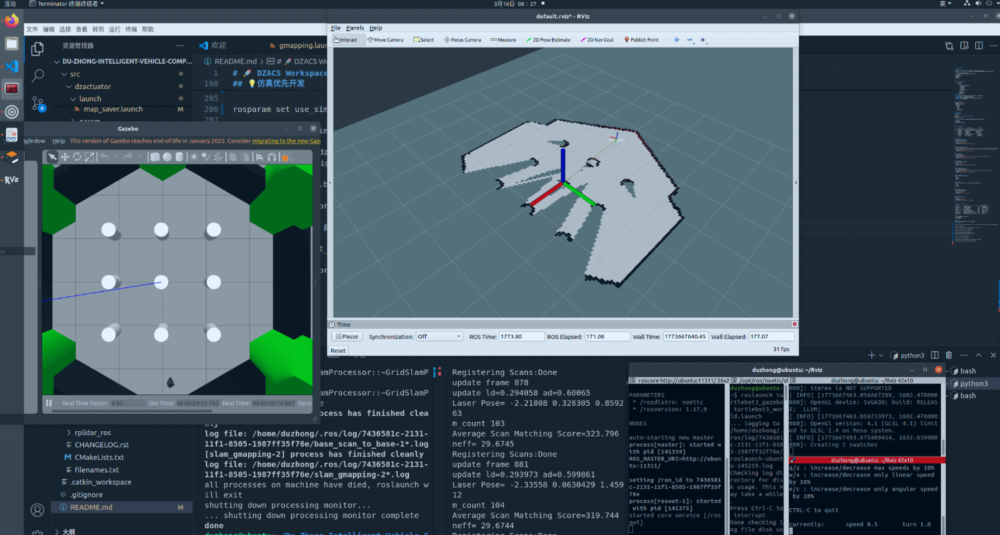

# 🚀 DZACS Workspace

## 1️⃣ 项目简介
📝说明：该仓库为原战队第二十届渡众智能车赛后继续开发的记录，持续优化导航效果
> 本项目是一个基于 **ROS Noetic** 开发的全国大学生智能汽车竞赛渡众车车对抗赛开源功能包，主要实现：

- 底盘控制（转向、云台、驱动电机等）
- 传感器数据采集与发布（雷达、IMU、轮速计、摄像头等）
- 建图与定位
- 导航与路径规划
- 裁判系统通信
- 地图保存
- 路径保存
- 靶标识别

---

## 2️⃣ 工作空间目录结构
    |--dzacs
        |-- build
        |-- devel
        |-- src
            |--clear_costmap_recovery
            |--dzactuator
            |--dzjudgment
            |--dzsavepath
            |--move_base
            |--navigation_msgs
            |--resource
            |--rknn_pt
            |--rplidar_ros
        |-- README.md
        |-- CHANGELOG.rst

### 📌 各目录说明：
- **src/**：存放所有源码包的目录，主要包括自定义功能包与第三方依赖包。
- **build/**：编译过程中产生的中间文件目录。
- **devel/** ：存放开发环境设置、可执行文件等。
- **README.md**：项目说明文档，记录工作空间的搭建、功能描述等内容。
- **CHANGELOG.rst**:更新日志记录

---

## 3️⃣ 环境要求
- ROS 版本：`ROS Noetic`
- 系统版本：`Ubuntu 20.04`
- 编译工具：`catkin_make`
- 三方依赖库：
    - Eigen3
    - OpenCV
    - serial
    - PCL
    - cv_bridge
    - image_transport

---

## 4️⃣ 编译方法
### ROS Noetic：
```bash
cd ~/dzacs/
rosdep install --from-paths src --ignore-src -r -y
catkin_make
source devel/setup.bash
```
> ⚠️ **注意**: 若正在使用北京渡众机器人科技有限公司发布的 DZACS 镜像请直接执行
> ```bash
> cd ~/dzacs/
> catkin_make
> source devel/setup.bash
> ```

---

## 5️⃣ 功能包列表与说明

|          功能包名          | 主要功能描述               | 更新记录       |
|------------------------|----------------------|:-----------|
| clear_costmap_recovery | 初始化位姿触发代价地图清除        | 2025-03-06 |
|       dzactuator       | DZVCU通信，获取IMU、轮速计等数据 | 2025-03-13 |
|       dzjudgment       | 裁判系统通信               | 2025-03-06 |
|       dzsavepath       | 保存路径                 | 2025-03-06 |
|       move_base        | 路径规划与控制              | 2025-03-06 |
|    navigation_msgs     | 导航消息包                | 2025-03-06 |
|        resource        | 地图、路径、停车点信息          | 2025-03-06 |
|        rknn_pt         | 靶标识别与发布              | 2025-03-06 |
|      rplidar_ros       | 雷达传感器驱动              | 2025-03-06 |

---

## 6️⃣ 功能包说明
### 📦 clear_costmap_recovery
- 功能：初始化位姿态清除代价地图
- 订阅 `/initialpose`
- 发布 `/move_base/clear_costmaps`
- 主要节点：`costmap_cleaner`
- 启动文件：`ros run costmap_cleaner costmap_cleaner`

---

### 📦 dzactuator
- 功能：与底盘通信并发布IMU、轮速计
- 订阅 `pursuitAngle`，`cmd_vel`，`/carema_monter_node/monter_control`，`offset_center`，`/move_base/stop_signal`
- 发布 `/PowerVoltage`，`Battery_Percentage`，`odom`，`raw`，`imu_data`，`imu_msg_valid`，`odom_msg_valid`，`LaserShot_Command`。
- 主要节点：`dzactuator`
- 启动文件：`ros launch dzactuator bringup.launch`

---

### 📦 dzjudgment
- 功能：裁判系统通信
- 订阅 `/LaserShot_Command`
- 发布 `HpAndHitmsg`，`all_Material_Number`，`enemy_Material_Number`，`self_Material_Number`
- 主要节点：`dzjudgment`
- 启动文件：`ros launch dzjudgment dzjudgment.launch`

---

### 📦 dzsavepath
- 功能：记录车辆行走轨迹生成路径
- 订阅 `amcl_pose`
- 发布 
- 主要节点：`dzsavepath`
- 启动文件：`ros launch dzsavepath dzsavepath.launch`

---

### 📦 move_base
- 功能：路径跟踪控制与指定点停车
- 订阅 `/scan`，`savemapping`
- 发布 `hgglobalplanner`，`hglocation`，`pursuitAngle`，`visualization_marker`，`stop_signal`
- 主要节点：`move_base_node`
- 启动文件：`ros run move_base_node move_base_node`

---

### 📦 navigation_msgs
- 功能：导航消息包，用于ROS消息创建
- 订阅
- 发布
- 主要节点
- 启动文件

---

### 📦 resource
- 功能：存储建立的地图（用于定位导航），存储建立的路径与指定停车点
- 订阅
- 发布
- 主要节点
- 启动文件

---

### 📦 rknn_pt
- 功能：识别靶标并发布位置信息
- 订阅 `/usb_cam/image_raw`
- 发布 `offset_center`
- 主要节点：`det_node`
- 启动文件：`ros run rknn_pt det_node`

---

### 📦 rplidar_ros
- 功能：获取雷达数据并发布
- 订阅 
- 发布 `scan`。
- 主要节点：`costmap_cleaner`
- 启动文件：`ros launch rplidar_ros rplidarNode`

---

## 7️⃣ 常用话题 (Topics)

| 话题名称               | 消息类型                              | 发布/订阅 | 描述         |
|--------------------|-----------------------------------|-------|------------|
| /cmd_vel           | geometry_msgs/Twist               | 订阅    | 底盘速度控制指令   |
| /pursuitAngle      | geometry_msgs/Twist               | 订阅    | 底盘速度控制指令   |
| /odom              | nav_msgs/Odometry                 | 发布    | 里程计信息      |
| /imu_data          | sensor_msgs/Imu                   | 发布    | IMU 传感器数据  |
| /usb_cam/image_raw | sensor_msgs::Image                | 发布    | 摄像头传感器数据   |
| /scan              | sensor_msgs/LaserScan             | 发布    | LiDAR 扫描数据 |
| offset_center      | std_msgs::Int32MultiArray         | 发布    | 识别的靶标坐标    |
| amcl_pose          | geometry_msgs::PoseWithCovariance | 发布    | 定位坐标       |
| LaserShot_Command  | std_msgs::UInt8                   | 订阅    | 激光发射信息     |
| initialpose        | geometry_msgs::PoseWithCovariance | 订阅    | 重置位姿       |
---

## 8️⃣ Information
- 作者：北京渡众机器人科技有限公司
- 日期：2025-03-06
- version：V1.0

---
## 9️⃣ License
私有声明，未经授权，不得复制、传播以用于商业目的。

# 🤖 Simulation-First Development

> This module focuses on **developing in simulation while reusing as much real robot code as possible**.  
> The goal is to **test algorithms without relying on the physical robot**, preparing for future deployment on the real platform.

**Environment**

- VM Image: **BJDZ_Namcha**
- OS: Ubuntu
- ROS: **ROS1 Noetic**
- Simulator: **Gazebo (TurtleBot3)**

---

# 🚀 Startup Procedure

Follow the steps below to start the simulation SLAM workflow.

---

## 1️⃣ Start ROS Master

```bash
roscore
```

## 2️⃣ Launch the Gazebo Simulation

```bash
roslaunch turtlebot3_gazebo turtlebot3_world.launch
```

## 3️⃣ Enable Simulation Time

```bash
rosparam set use_sim_time true
```

## 4️⃣ Compile the dzactuator Package

```bash
cd Du-Zhong-Intelligent-Vehicle-Competition/
catkin_make --pkg dzactuator
```

## 4️⃣ Compile the dzactuator Package

```bash
cd Du-Zhong-Intelligent-Vehicle-Competition/
catkin_make --pkg dzactuator
source devel/setup.bash
```

## 5️⃣ Start SLAM (Gmapping)

```bash
roslaunch dzactuator gmapping.launch
```
This launches the Gmapping SLAM node to build a map using LiDAR data.

## 6️⃣ Launch RViz Visualization

```bash
rviz -d rviz.rviz
```

## 7️⃣ Control the Robot to Build the Map

```bash
rosrun teleop_twist_keyboard teleop_twist_keyboard.py
```
Use the keyboard to move the robot and explore the environment to generate a complete map.



## 8️⃣ Save the Generated Map

```bash
roslaunch dzactuator map_saver.launch
```
